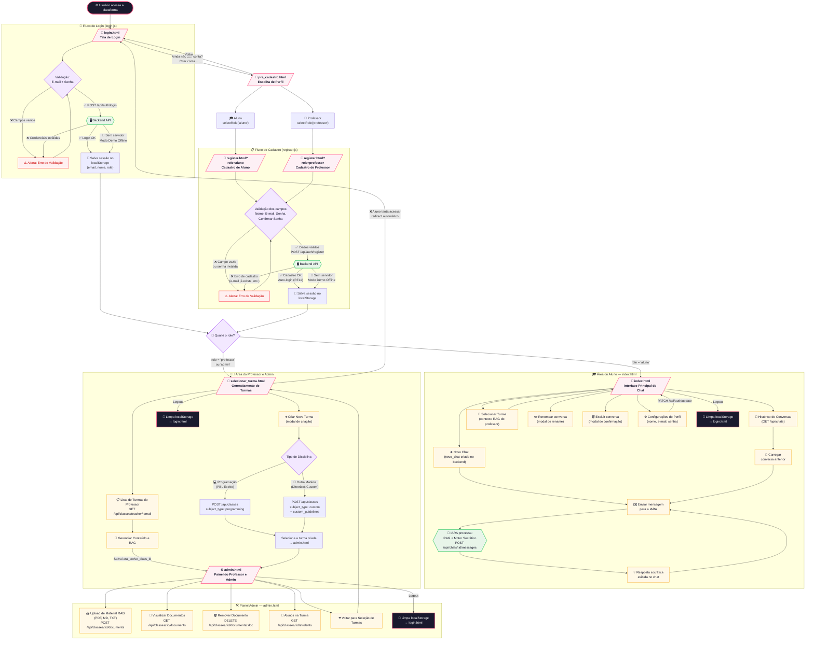

```mermaid
flowchart TD
    %% ──────────────── ENTRADA ────────────────
    START([🌐 Usuário acessa a plataforma])

    START --> LOGIN[/"🔐 login.html\nTela de Login"/]

    LOGIN -->|"Ainda não tem conta?\nCriar conta"| PRE_CAD[/"👤 pre_cadastro.html\nEscolha de Perfil"/]

    %% ──────────────── PRÉ-CADASTRO ────────────────
    PRE_CAD --> ROLE_ALUNO["🎓 Aluno\nselectRole('aluno')"]
    PRE_CAD --> ROLE_PROF["📖 Professor\nselectRole('professor')"]
    PRE_CAD -->|"Voltar"| LOGIN

    ROLE_ALUNO --> REGISTER_ALUNO[/"📝 register.html?role=aluno\nCadastro de Aluno"/]
    ROLE_PROF  --> REGISTER_PROF[/"📝 register.html?role=professor\nCadastro de Professor"/]

    %% ──────────────── CADASTRO ────────────────
    subgraph CADASTRO ["📋 Fluxo de Cadastro (register.js)"]
        REGISTER_ALUNO --> VAL_REG{Validação dos campos\nNome, E-mail, Senha,\nConfirmar Senha}
        REGISTER_PROF  --> VAL_REG

        VAL_REG -->|"❌ Campo vazio\nou senha inválida"| ERR_REG["⚠️ Alerta: Erro de Validação"]
        ERR_REG --> VAL_REG

        VAL_REG -->|"✅ Dados válidos\nPOST /api/auth/register"| API_REG{{"🖥️ Backend API"}}
        API_REG -->|"✅ Cadastro OK\nAuto-login (RF11)"| SAVE_SESSION_REG["💾 Salva sessão no\nlocalStorage"]
        API_REG -->|"❌ Erro de cadastro\n(e-mail já existe, etc.)"| ERR_REG
        API_REG -->|"🔌 Sem servidor\nModo Demo Offline"| SAVE_SESSION_REG
    end

    %% ──────────────── LOGIN ────────────────
    subgraph AUTH ["🔑 Fluxo de Login (login.js)"]
        LOGIN --> VAL_LOGIN{Validação:\nE-mail + Senha}
        VAL_LOGIN -->|"❌ Campos vazios"| ERR_LOGIN["⚠️ Alerta: Erro de Validação"]
        ERR_LOGIN --> VAL_LOGIN
        VAL_LOGIN -->|"✅ POST /api/auth/login"| API_LOGIN{{"🖥️ Backend API"}}
        API_LOGIN -->|"✅ Login OK"| SAVE_SESSION["💾 Salva sessão no\nlocalStorage\n(email, nome, role)"]
        API_LOGIN -->|"❌ Credenciais inválidas"| ERR_LOGIN
        API_LOGIN -->|"🔌 Sem servidor\nModo Demo Offline"| SAVE_SESSION
    end

    %% ──────────────── ROTEAMENTO POR PERFIL ────────────────
    SAVE_SESSION     --> ROLE_CHECK{"👤 Qual é o role?"}
    SAVE_SESSION_REG --> ROLE_CHECK

    ROLE_CHECK -->|"role = 'aluno'"| CHAT_PAGE
    ROLE_CHECK -->|"role = 'professor'\nou 'admin'"| TURMAS_PAGE

    %% ──────────────── ÁREA DO ALUNO ────────────────
    subgraph STUDENT ["🎓 Área do Aluno — index.html"]
        CHAT_PAGE[/"💬 index.html\nInterface Principal de Chat"/]

        CHAT_PAGE --> NEW_CHAT["➕ Novo Chat\n(novo_chat criado no backend)"]
        CHAT_PAGE --> HIST["📜 Histórico de Conversas\n(GET /api/chats)"]

        NEW_CHAT --> SEND_MSG["✉️ Enviar mensagem\npara a IARA"]
        HIST --> LOAD_CHAT["📂 Carregar\nconversa anterior"]
        LOAD_CHAT --> SEND_MSG

        SEND_MSG --> RAG_PROC{{"🤖 IARA processa:\nRAG + Motor Socrático\nPOST /api/chats/:id/messages"}}
        RAG_PROC --> RESP["💡 Resposta socrática\nexibida no chat"]
        RESP --> SEND_MSG

        CHAT_PAGE --> SEL_TURMA_ALUNO["🏫 Selecionar Turma\n(contexto RAG do professor)"]
        SEL_TURMA_ALUNO --> CHAT_PAGE

        CHAT_PAGE --> RENAME_CHAT["✏️ Renomear conversa\n(modal de rename)"]
        CHAT_PAGE --> DEL_CHAT["🗑️ Excluir conversa\n(modal de confirmação)"]

        CHAT_PAGE --> SETTINGS_MODAL["⚙️ Configurações do Perfil\n(nome, e-mail, senha)"]
        SETTINGS_MODAL -->|"PATCH /api/auth/update"| CHAT_PAGE

        CHAT_PAGE -->|"Logout"| LOGOUT_S["🚪 Limpa localStorage\n→ login.html"]
    end

    %% ──────────────── ÁREA DO PROFESSOR / ADMIN ────────────────
    subgraph PROFESSOR ["👨‍🏫 Área do Professor e Admin"]
        TURMAS_PAGE[/"🏫 selecionar_turma.html\nGerenciamento de Turmas"/]

        TURMAS_PAGE --> CREATE_CLASS["➕ Criar Nova Turma\n(modal de criação)"]
        CREATE_CLASS --> CLASS_TYPE{"Tipo de Disciplina"}
        CLASS_TYPE -->|"💻 Programação\n(PBL Estrito)"| POST_CLASS_P["POST /api/classes\nsubject_type: programming"]
        CLASS_TYPE -->|"📝 Outra Matéria\n(Diretrizes Custom)"| POST_CLASS_C["POST /api/classes\nsubject_type: custom\n+ custom_guidelines"]
        POST_CLASS_P --> SEL_CLASS["Seleciona a turma criada\n→ admin.html"]
        POST_CLASS_C --> SEL_CLASS

        TURMAS_PAGE --> LIST_CLASSES["📋 Lista de Turmas do Professor\nGET /api/classes/teacher/:email"]
        LIST_CLASSES --> SELECT_CLASS_BTN["🔘 Gerenciar Conteúdo e RAG"]
        SELECT_CLASS_BTN -->|"Salva iara_active_class_id"| ADMIN_PAGE

        TURMAS_PAGE -->|"Logout"| LOGOUT_P["🚪 Limpa localStorage\n→ login.html"]
    end

    subgraph ADMIN ["🛠️ Painel Admin — admin.html"]
        ADMIN_PAGE[/"⚙️ admin.html\nPainel do Professor e Admin"/]
        SEL_CLASS --> ADMIN_PAGE

        ADMIN_PAGE --> UPLOAD_RAG["📤 Upload de Material RAG\n(PDF, MD, TXT)\nPOST /api/classes/:id/documents"]
        ADMIN_PAGE --> VIEW_DOCS["📂 Visualizar Documentos\nGET /api/classes/:id/documents"]
        ADMIN_PAGE --> DEL_DOC["🗑️ Remover Documento\nDELETE /api/classes/:id/documents/:doc"]
        ADMIN_PAGE --> STUDENTS["👥 Alunos na Turma\nGET /api/classes/:id/students"]
        ADMIN_PAGE --> BACK_TURMAS["⬅️ Voltar para Seleção de Turmas"]
        BACK_TURMAS --> TURMAS_PAGE

        ADMIN_PAGE -->|"Logout"| LOGOUT_A["🚪 Limpa localStorage\n→ login.html"]
    end

    %% ──────────────── ACESSO RESTRITO ────────────────
    TURMAS_PAGE -->|"❌ Aluno tenta acessar\nredirect automático"| LOGIN

    %% ──────────────── ESTILOS ────────────────
    classDef page        fill:#fdf0f5,stroke:#ff5c8a,stroke-width:2px,color:#1a1a2e,font-weight:bold
    classDef decision    fill:#f3e8ff,stroke:#a855f7,stroke-width:2px,color:#1a1a2e
    classDef action      fill:#fff8e7,stroke:#f59e0b,stroke-width:1px,color:#1a1a2e
    classDef api         fill:#e8f5e9,stroke:#22c55e,stroke-width:2px,color:#1a1a2e
    classDef error       fill:#fff0f0,stroke:#ff4757,stroke-width:1.5px,color:#cc0000
    classDef terminal    fill:#1a1a2e,stroke:#ff5c8a,stroke-width:2px,color:#ffffff

    class LOGIN,PRE_CAD,REGISTER_ALUNO,REGISTER_PROF,CHAT_PAGE,TURMAS_PAGE,ADMIN_PAGE page
    class VAL_REG,VAL_LOGIN,ROLE_CHECK,CLASS_TYPE decision
    class NEW_CHAT,HIST,SEND_MSG,RESP,RENAME_CHAT,DEL_CHAT,SETTINGS_MODAL,CREATE_CLASS,LIST_CLASSES,SELECT_CLASS_BTN,UPLOAD_RAG,VIEW_DOCS,DEL_DOC,STUDENTS,BACK_TURMAS,SEL_TURMA_ALUNO,LOAD_CHAT action
    class API_REG,API_LOGIN,RAG_PROC api
    class ERR_REG,ERR_LOGIN error
    class START,LOGOUT_S,LOGOUT_P,LOGOUT_A terminal
```
