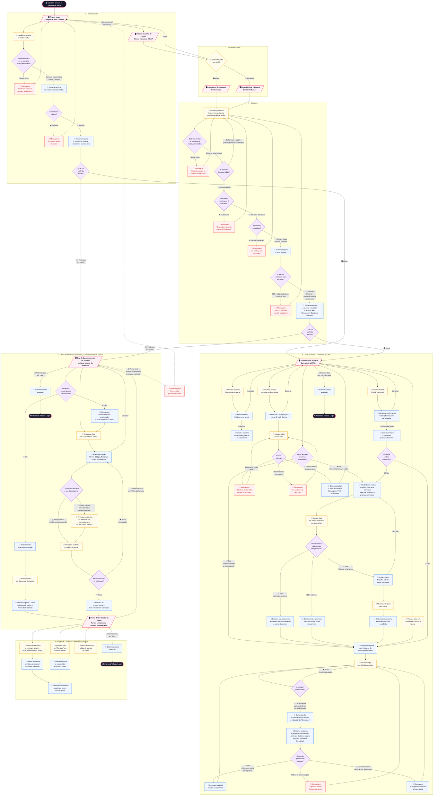

```mermaid
flowchart TD

    %% ══════════════════════════════════════════════
    %%  LEGENDA DE CORES
    %%  🟣 Roxo/Rosa  → Tela / Página da plataforma
    %%  🟡 Amarelo    → Ação do Usuário
    %%  🔵 Azul       → Resposta / Feedback do Sistema
    %%  🟠 Laranja    → Ponto de Decisão
    %%  🔴 Vermelho   → Mensagem de Erro
    %%  ⚫ Escuro     → Início / Fim do Fluxo
    %% ══════════════════════════════════════════════

    START([▶ Usuário acessa a plataforma IARA])
    START --> TELA_LOGIN

    %% ─────────────────────────────────────────────
    %%  BLOCO 1 — TELA DE LOGIN
    %% ─────────────────────────────────────────────
    subgraph BL1 ["  1 · Tela de Login  "]
        TELA_LOGIN[/🖥 Tela de Login\nCampos: E-mail e Senha/]

        TELA_LOGIN --> U_PREENCHE_LOGIN["👤 Usuário preenche\ne-mail e senha"]
        TELA_LOGIN -->|"Não tem conta?\nCriar conta"| TELA_PRECAD

        U_PREENCHE_LOGIN --> DEC_CAMPOS_LOGIN{"Sistema verifica\nse os campos\nestão preenchidos"}

        DEC_CAMPOS_LOGIN -->|"Campo vazio"| ERR_CAMPO_LOGIN["🔴 Mensagem:\n'Preencha todos os\ncampos obrigatórios'"]
        ERR_CAMPO_LOGIN --> TELA_LOGIN

        DEC_CAMPOS_LOGIN -->|"Campos preenchidos\nUsuário confirma"| SIS_VERIFICA_CRED["🔵 Sistema verifica\nas credenciais informadas"]

        SIS_VERIFICA_CRED --> DEC_CRED{"Credenciais\nválidas?"}
        DEC_CRED -->|"❌ Inválidas"| ERR_CRED["🔴 Mensagem:\n'E-mail ou senha\ninválidos'"]
        ERR_CRED --> TELA_LOGIN

        DEC_CRED -->|"✅ Válidas"| SIS_SALVA_SESSAO["🔵 Sistema registra\na sessão do usuário\ne mantém o acesso ativo"]
        SIS_SALVA_SESSAO --> DEC_PERFIL_LOGIN
    end

    %% ─────────────────────────────────────────────
    %%  BLOCO 2 — PRÉ-CADASTRO
    %% ─────────────────────────────────────────────
    subgraph BL2 ["  2 · Escolha de Perfil  "]
        TELA_PRECAD[/🖥 Tela de Escolha de Perfil\n'Quem vai usar a IARA?'/]

        TELA_PRECAD --> U_ESCOLHE_PERFIL{"👤 Usuário escolhe\nseu perfil"}
        U_ESCOLHE_PERFIL -->|"🎓 Aluno"| TELA_CAD_ALUNO
        U_ESCOLHE_PERFIL -->|"📖 Professor"| TELA_CAD_PROF
        U_ESCOLHE_PERFIL -->|"Voltar"| TELA_LOGIN
    end

    %% ─────────────────────────────────────────────
    %%  BLOCO 3 — CADASTRO
    %% ─────────────────────────────────────────────
    subgraph BL3 ["  3 · Cadastro  "]
        TELA_CAD_ALUNO[/🖥 Formulário de Cadastro\nPerfil: Aluno/]
        TELA_CAD_PROF[/🖥 Formulário de Cadastro\nPerfil: Professor/]

        TELA_CAD_ALUNO --> U_PREENCHE_CAD["👤 Usuário preenche\nNome, E-mail, Senha\ne Confirmação de Senha"]
        TELA_CAD_PROF  --> U_PREENCHE_CAD

        U_PREENCHE_CAD --> DEC_CAMPOS_CAD{"Sistema verifica\nse os campos\nestão preenchidos"}

        DEC_CAMPOS_CAD -->|"Campo vazio"| ERR_VAZIO_CAD["🔴 Mensagem:\n'Preencha todos os\ncampos obrigatórios'"]
        ERR_VAZIO_CAD --> U_PREENCHE_CAD

        DEC_CAMPOS_CAD -->|"Campos preenchidos"| DEC_EMAIL_CAD{"E-mail tem\nformato válido?"}
        DEC_EMAIL_CAD -->|"❌ Formato inválido\n(indicação visual no campo)"| U_PREENCHE_CAD

        DEC_EMAIL_CAD -->|"✅ Formato válido"| DEC_SENHA_CAD{"Senha tem\nmínimo de 4\ncaracteres?"}
        DEC_SENHA_CAD -->|"❌ Muito curta"| ERR_SENHA_CURTA["🔴 Mensagem:\n'Senha deve ter pelo\nmenos 4 caracteres'"]
        ERR_SENHA_CURTA --> U_PREENCHE_CAD

        DEC_SENHA_CAD -->|"✅ Tamanho adequado"| DEC_CONF_SENHA{"As senhas\ncoincident?"}
        DEC_CONF_SENHA -->|"❌ Senhas diferentes"| ERR_SENHA_CONF["🔴 Mensagem:\n'As senhas não\ncoincident'"]
        ERR_SENHA_CONF --> U_PREENCHE_CAD

        DEC_CONF_SENHA -->|"✅ Senhas iguais\nUsuário confirma"| SIS_REGISTRA["🔵 Sistema registra\no novo usuário"]

        SIS_REGISTRA --> DEC_CAD_OK{"Cadastro\nrealizado com\nsucesso?"}
        DEC_CAD_OK -->|"❌ E-mail já cadastrado\nou outro erro"| ERR_CAD["🔴 Mensagem:\n'Não foi possível\nconcluir o cadastro'"]
        ERR_CAD --> U_PREENCHE_CAD

        DEC_CAD_OK -->|"✅ Sucesso\nUsuário é\nautomaticamente\nautenticado"| SIS_SALVA_SESSAO_CAD["🔵 Sistema registra\na sessão e mantém\no acesso ativo\nMensagem: 'Cadastro realizado!'"]
        SIS_SALVA_SESSAO_CAD --> DEC_PERFIL_CAD
    end

    %% ─────────────────────────────────────────────
    %%  ROTEAMENTO POR PERFIL
    %% ─────────────────────────────────────────────
    DEC_PERFIL_LOGIN{"Qual é o\nperfil do\nusuário?"}
    DEC_PERFIL_CAD{"Qual é o\nperfil do\nusuário?"}

    DEC_PERFIL_LOGIN -->|"🎓 Aluno"| AREA_ALUNO
    DEC_PERFIL_LOGIN -->|"👨‍🏫 Professor\nou Admin"| AREA_PROF

    DEC_PERFIL_CAD -->|"🎓 Aluno"| AREA_ALUNO
    DEC_PERFIL_CAD -->|"👨‍🏫 Professor\nou Admin"| AREA_PROF

    %% ─────────────────────────────────────────────
    %%  BLOCO 4 — ÁREA DO ALUNO
    %% ─────────────────────────────────────────────
    subgraph BL4 ["  4 · Área do Aluno — Interface de Chat  "]
        AREA_ALUNO[/🖥 Tela Principal de Chat\nBem-vindo à IARA!/]

        AREA_ALUNO --> DEC_TEM_CONV{"Aluno já possui\nconversas\nanteriores?"}

        DEC_TEM_CONV -->|"✅ Sim\nSistema carrega\na mais recente"| CHAT_ABERTO["🔵 Conversa carregada\ncom histórico de\nmensagens exibido"]

        DEC_TEM_CONV -->|"❌ Não\nExibe tela de boas-vindas"| TELA_BOAS_VINDAS["🔵 Tela de boas-vindas:\n'Comece uma nova conversa\npara tirar dúvidas ou\npraticar exercícios'"]

        TELA_BOAS_VINDAS --> U_INICIA_CONV["👤 Usuário clica\nem 'Iniciar conversa'\nou 'Novo Chat'"]

        U_INICIA_CONV --> DEC_TEM_TURMAS{"Existem turmas\ncadastradas\npelo professor?"}
        DEC_TEM_TURMAS -->|"✅ Sim\nApenas uma turma"| CONV_CRIADA_AUTO["🔵 Sistema cria a conversa\nassociada automaticamente\nà turma disponível"]
        DEC_TEM_TURMAS -->|"✅ Sim\nMais de uma turma"| MODAL_TURMA["🔵 Modal exibido:\n'Escolha a turma\ndesta conversa'"]
        DEC_TEM_TURMAS -->|"❌ Sem turmas"| CONV_CRIADA_LIVRE["🔵 Sistema cria a conversa\nsem vínculo de turma\n(modo livre)"]

        MODAL_TURMA --> U_ESCOLHE_TURMA["👤 Usuário seleciona\numa turma"]
        U_ESCOLHE_TURMA --> CONV_CRIADA_TURMA["🔵 Sistema cria conversa\nassociada à turma escolhida"]
        MODAL_TURMA -->|"Cancelar"| TELA_BOAS_VINDAS

        CONV_CRIADA_AUTO --> CHAT_ABERTO
        CONV_CRIADA_LIVRE --> CHAT_ABERTO
        CONV_CRIADA_TURMA --> CHAT_ABERTO
        CHAT_ABERTO --> U_DIGITA["👤 Usuário digita\nsua dúvida ou código"]

        U_DIGITA --> DEC_MSG_VAZIA{"Mensagem\npreenchida?"}
        DEC_MSG_VAZIA -->|"❌ Vazia\n(envio bloqueado)"| U_DIGITA

        DEC_MSG_VAZIA -->|"✅ Usuário envia\npela tecla Enter\nou botão Enviar"| SIS_PROCESSA["🔵 Sistema exibe\na mensagem do usuário\ne indicador de 'Gerando...'"]

        SIS_PROCESSA --> SIS_GERA_RESP["🔵 Sistema processa\na pergunta com base no\nconteúdo da turma e gera\nresposta orientada (socrática)"]

        SIS_GERA_RESP --> DEC_RESP_OK{"Resposta\ngerada com\nsucesso?"}

        DEC_RESP_OK -->|"✅ Sim\nExibe com efeito\nde digitação"| RESP_EXIBIDA["🔵 Resposta da IARA\nexibida na conversa"]
        RESP_EXIBIDA --> U_DIGITA

        DEC_RESP_OK -->|"❌ Erro de comunicação"| ERR_RESP["🔵 Mensagem:\n'Algo deu errado.\nTente novamente!'"]
        ERR_RESP --> U_DIGITA

        DEC_RESP_OK -->|"🚫 Usuário cancela\ngeração em andamento"| CANCEL_RESP["🔵 Mensagem:\n'Geração da resposta\nfoi cancelada'"]
        CANCEL_RESP --> U_DIGITA

        %% Histórico
        AREA_ALUNO --> HIST_LATERAL["👤 Usuário clica em\nconversa no histórico\nlateral"]
        HIST_LATERAL --> CHAT_ABERTO

        %% Ações sobre conversas
        AREA_ALUNO --> U_RENOMEAR["👤 Usuário clica em\n'Renomear conversa'"]
        U_RENOMEAR --> MODAL_RENAME["🔵 Modal exibido:\n'Digite o novo nome'"]
        MODAL_RENAME -->|"Confirma"| SIS_RENAME["🔵 Sistema atualiza\no nome da conversa\nna lista lateral"]
        MODAL_RENAME -->|"Cancelar"| AREA_ALUNO

        AREA_ALUNO --> U_EXCLUIR["👤 Usuário clica em\n'Excluir conversa'"]
        U_EXCLUIR --> MODAL_DELETE["🔵 Modal de confirmação:\n'Esta ação não pode\nser desfeita'"]
        MODAL_DELETE -->|"Confirma exclusão"| SIS_DELETE["🔵 Sistema remove\na conversa permanentemente"]
        SIS_DELETE --> DEC_SOBROU_CONV{"Ainda há\noutras\nconversas?"}
        DEC_SOBROU_CONV -->|"✅ Sim"| CHAT_ABERTO
        DEC_SOBROU_CONV -->|"❌ Não"| TELA_BOAS_VINDAS
        MODAL_DELETE -->|"Cancelar"| AREA_ALUNO

        %% Configurações
        AREA_ALUNO --> U_CONFIG["👤 Usuário clica no\nícone de configurações"]
        U_CONFIG --> MODAL_CONFIG["🔵 Modal de Configurações:\nNome, E-mail, Senha"]

        MODAL_CONFIG --> U_EDITA_PERFIL["👤 Usuário edita\nseus dados"]
        U_EDITA_PERFIL --> DEC_CONFIG_VAL{"Dados\nválidos?"}
        DEC_CONFIG_VAL -->|"❌ Nome ou e-mail\nvazio"| ERR_CONFIG["🔴 Mensagem:\n'Nome e E-mail não\npodem ficar vazios'"]
        ERR_CONFIG --> U_EDITA_PERFIL
        DEC_CONFIG_VAL -->|"❌ Senhas não\ncoincident"| ERR_CONF_SENHA_CFG["🔴 Mensagem:\n'As senhas não\ncoincident'"]
        ERR_CONF_SENHA_CFG --> U_EDITA_PERFIL
        DEC_CONFIG_VAL -->|"✅ Dados válidos\nUsuário salva"| SIS_ATUALIZA_PERFIL["🔵 Sistema atualiza\no perfil do usuário\nMensagem: 'Perfil atualizado!'"]
        SIS_ATUALIZA_PERFIL --> AREA_ALUNO
        MODAL_CONFIG -->|"Cancelar"| AREA_ALUNO

        %% Logout Aluno
        AREA_ALUNO -->|"👤 Usuário clica\nem 'Sair da Conta'"| LOGOUT_A["🔵 Sistema encerra\na sessão"]
        LOGOUT_A --> FIM_A([⏹ Retorna à Tela de Login])
    end

    %% ─────────────────────────────────────────────
    %%  BLOCO 5 — ÁREA DO PROFESSOR / ADMIN
    %% ─────────────────────────────────────────────
    subgraph BL5 ["  5 · Área do Professor e Admin — Gerenciamento de Turmas  "]
        AREA_PROF[/🖥 Tela de Gerenciamento de Turmas\nLista de turmas do professor/]

        AREA_PROF --> DEC_TEM_TURMAS_PROF{"Professor\npossui turmas\ncadastradas?"}
        DEC_TEM_TURMAS_PROF -->|"✅ Sim"| LISTA_TURMAS["🔵 Sistema exibe\nas turmas em grade"]
        DEC_TEM_TURMAS_PROF -->|"❌ Não"| MSG_SEM_TURMAS["🔵 Mensagem:\n'Nenhuma turma encontrada.\nCrie sua primeira turma.'"]

        LISTA_TURMAS --> U_SELECIONA_TURMA["👤 Professor clica\nem 'Gerenciar Conteúdo'"]
        U_SELECIONA_TURMA --> SIS_ABRE_PAINEL["🔵 Sistema registra a turma\nselecionada e abre o\nPainel de Conteúdo"]
        SIS_ABRE_PAINEL --> AREA_ADMIN

        AREA_PROF --> U_CRIA_TURMA["👤 Professor clica\nem '+ Criar Nova Turma'"]
        MSG_SEM_TURMAS --> U_CRIA_TURMA
        U_CRIA_TURMA --> MODAL_TURMA_PROF["🔵 Modal de criação:\nNome, Código, Descrição\ne Tipo da Disciplina"]

        MODAL_TURMA_PROF --> DEC_TIPO_DISC{"👤 Professor escolhe\no tipo da disciplina"}
        DEC_TIPO_DISC -->|"💻 Programação\n(modo socrático padrão)"| U_CONFIRMA_TURMA["👤 Professor confirma\na criação da turma"]
        DEC_TIPO_DISC -->|"📝 Outra matéria\n(com diretrizes personalizadas)"| U_DIGITA_DIRETRIZES["👤 Professor preenche\nas diretrizes de comportamento\nda IARA para a turma"]
        U_DIGITA_DIRETRIZES --> U_CONFIRMA_TURMA

        U_CONFIRMA_TURMA --> DEC_NOME_TURMA{"Nome da turma\nfoi informado?"}
        DEC_NOME_TURMA -->|"❌ Vazio\n(bloqueado)"| MODAL_TURMA_PROF
        DEC_NOME_TURMA -->|"✅ Válido"| SIS_CRIA_TURMA["🔵 Sistema cria\na nova turma e\nabre o Painel de Conteúdo"]
        SIS_CRIA_TURMA --> AREA_ADMIN

        MODAL_TURMA_PROF -->|"Cancelar"| AREA_PROF

        %% Logout Professor
        AREA_PROF -->|"👤 Professor clica\nem 'Sair'"| LOGOUT_P["🔵 Sistema encerra\na sessão"]
        LOGOUT_P --> FIM_P([⏹ Retorna à Tela de Login])
    end

    %% ─────────────────────────────────────────────
    %%  BLOCO 6 — PAINEL DE CONTEÚDO (ADMIN)
    %% ─────────────────────────────────────────────
    subgraph BL6 ["  6 · Painel de Conteúdo e Materiais — admin  "]
        AREA_ADMIN[/🖥 Painel de Conteúdo da Turma\nTurma selecionada exibida no cabeçalho/]

        AREA_ADMIN --> U_UPLOAD["👤 Professor seleciona\ne envia um arquivo\n(PDF, Markdown ou Texto)"]
        U_UPLOAD --> SIS_UPLOAD["🔵 Sistema processa\ne indexa o material\nno acervo da turma"]
        SIS_UPLOAD --> SIS_LISTA_DOCS["🔵 Lista de documentos\natualizada com o\nnovo material"]

        AREA_ADMIN --> U_REMOVE_DOC["👤 Professor clica\nem 'Remover' em\num documento"]
        U_REMOVE_DOC --> SIS_REMOVE_DOC["🔵 Sistema remove\no material do\nacervo da turma"]
        SIS_REMOVE_DOC --> SIS_LISTA_DOCS

        AREA_ADMIN --> U_VER_ALUNOS["👤 Professor visualiza\na lista de alunos\nda turma"]

        AREA_ADMIN -->|"👤 Professor clica\nem 'Voltar às Turmas'"| AREA_PROF

        %% Logout Admin
        AREA_ADMIN -->|"👤 Professor clica\nem 'Sair'"| LOGOUT_ADM["🔵 Sistema encerra\na sessão"]
        LOGOUT_ADM --> FIM_ADM([⏹ Retorna à Tela de Login])
    end

    %% ─────────────────────────────────────────────
    %%  ACESSO RESTRITO
    %% ─────────────────────────────────────────────
    ACESSO_REST["🔴 Acesso negado:\nÁrea restrita\npara professores"]
    AREA_PROF -.->|"❌ Aluno tenta\nacessar diretamente\na área do professor"| ACESSO_REST
    ACESSO_REST -.-> TELA_LOGIN

    %% ─────────────────────────────────────────────
    %%  ESTILOS
    %% ─────────────────────────────────────────────
    classDef tela       fill:#fdf0f5,stroke:#ff5c8a,stroke-width:2.5px,color:#1a1a2e,font-weight:bold
    classDef acao       fill:#fffbea,stroke:#f59e0b,stroke-width:1.5px,color:#1a1a2e
    classDef sistema    fill:#eff6ff,stroke:#3b82f6,stroke-width:1.5px,color:#1a1a2e
    classDef decisao    fill:#f3e8ff,stroke:#a855f7,stroke-width:2px,color:#1a1a2e
    classDef erro       fill:#fff0f0,stroke:#ef4444,stroke-width:1.5px,color:#b91c1c
    classDef terminal   fill:#1a1a2e,stroke:#ff5c8a,stroke-width:2px,color:#ffffff,font-weight:bold

    class TELA_LOGIN,TELA_PRECAD,TELA_CAD_ALUNO,TELA_CAD_PROF,AREA_ALUNO,AREA_PROF,AREA_ADMIN tela
    class U_PREENCHE_LOGIN,U_PREENCHE_CAD,U_INICIA_CONV,U_DIGITA,U_ESCOLHE_TURMA,U_RENOMEAR,U_EXCLUIR,U_CONFIG,U_EDITA_PERFIL,U_SELECIONA_TURMA,U_CRIA_TURMA,U_DIGITA_DIRETRIZES,U_CONFIRMA_TURMA,U_UPLOAD,U_REMOVE_DOC,U_VER_ALUNOS,U_ESCOLHE_PERFIL,HIST_LATERAL acao
    class SIS_VERIFICA_CRED,SIS_SALVA_SESSAO,SIS_REGISTRA,SIS_SALVA_SESSAO_CAD,CHAT_ABERTO,TELA_BOAS_VINDAS,CONV_CRIADA_AUTO,CONV_CRIADA_LIVRE,CONV_CRIADA_TURMA,SIS_PROCESSA,SIS_GERA_RESP,RESP_EXIBIDA,ERR_RESP,CANCEL_RESP,MODAL_RENAME,SIS_RENAME,MODAL_DELETE,SIS_DELETE,MODAL_CONFIG,SIS_ATUALIZA_PERFIL,LOGOUT_A,LOGOUT_P,LOGOUT_ADM,LISTA_TURMAS,MSG_SEM_TURMAS,SIS_ABRE_PAINEL,MODAL_TURMA_PROF,SIS_CRIA_TURMA,SIS_UPLOAD,SIS_LISTA_DOCS,SIS_REMOVE_DOC,MODAL_TURMA sistema
    class DEC_CAMPOS_LOGIN,DEC_CRED,DEC_PERFIL_LOGIN,DEC_PERFIL_CAD,DEC_CAMPOS_CAD,DEC_EMAIL_CAD,DEC_SENHA_CAD,DEC_CONF_SENHA,DEC_CAD_OK,DEC_TEM_CONV,DEC_TEM_TURMAS,DEC_MSG_VAZIA,DEC_RESP_OK,DEC_SOBROU_CONV,DEC_CONFIG_VAL,DEC_TEM_TURMAS_PROF,DEC_TIPO_DISC,DEC_NOME_TURMA decisao
    class ERR_CAMPO_LOGIN,ERR_CRED,ERR_VAZIO_CAD,ERR_SENHA_CURTA,ERR_SENHA_CONF,ERR_CAD,ERR_RESP,ERR_CONFIG,ERR_CONF_SENHA_CFG,ACESSO_REST erro
    class START,FIM_A,FIM_P,FIM_ADM terminal
```
